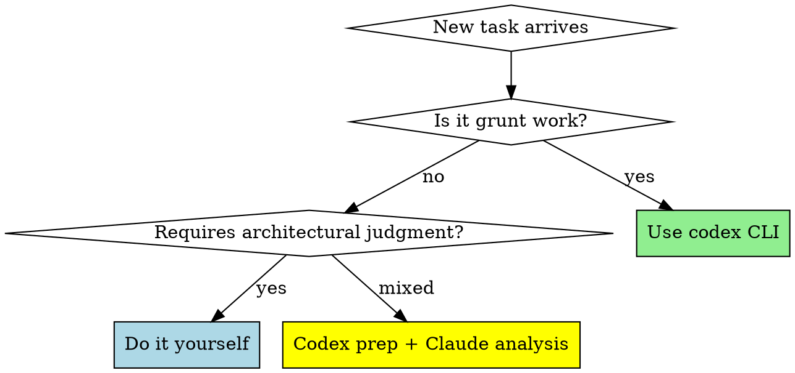

# Codex Delegation Protocol

## Overview

**Core principle:** Codex handles grunt work (200-3000 tokens/task), Claude handles architecture (minimal tokens). This multiplies effective context budget 10-50x.

## When to Use



**Grunt work = delegate to codex:**
- File searches, counting, listing
- Pattern matching across codebase
- Simple refactoring (rename, extract constant)
- Boilerplate generation (tests, interfaces)
- Code cleanup (remove comments, format)
- Dependency analysis (who calls what)
- Dead code detection

**Architectural work = Claude does:**
- Design decisions (SSOT, dependency injection)
- Critical business logic review
- State management architecture
- Integration strategy
- Complex refactoring planning
- Security/performance trade-offs

**Mixed = codex prep, Claude decides:**
- "Find all large files" → codex lists → Claude decides which to refactor
- "Find deprecated APIs" → codex finds → Claude plans migration
- "List god objects" → codex counts → Claude designs split

## Quick Reference

| Task Type | Tool | Example |
|-----------|------|---------|
| Count files | `codex exec` | `codex exec "count Swift files in ViewModels/"` |
| Find pattern | `codex exec` | `codex exec "find all .shared singleton calls"` |
| List by size | `codex exec` | `codex exec "list services over 500 lines, sorted"` |
| Simple refactor | `codex exec` | `codex exec "extract colors to Colors.swift"` |
| Boilerplate | `codex exec` | `codex exec "create unit test for PortfolioStore"` |
| Architecture | **Claude** | Design SSOT strategy, DI patterns |
| Critical logic | **Claude** | Review decision engine, state management |
| Trade-offs | **Claude** | Performance vs maintainability decisions |

## Implementation

### Before Every Grunt Task

**STOP. Ask yourself:**

1. **"Is this a search/count/list/pattern task?"** → YES = codex
2. **"Could I describe this task in one sentence?"** → YES = codex
3. **"Does this require architectural judgment?"** → NO = codex

### Using Codex

```bash
# File operations
codex exec "count all Swift files in Services/"
codex exec "list ViewModels over 300 lines, sorted by size"
codex exec "find all TODO comments"

# Pattern matching
codex exec "find all .shared singleton calls"
codex exec "find deprecated API usages"
codex exec "find all God objects (500+ lines)"

# Refactoring prep
codex exec "list all hardcoded colors"
codex exec "find duplicate code blocks"
codex exec "identify unused imports"

# Code generation
codex exec "create unit test template for MarketDataStore"
codex exec "generate Equatable conformance for Trade struct"
```

### Using Gemini (if codex fails)

```bash
# Same syntax
gemini "your task here"
```

### After Codex Returns

**Claude's job:** Analyze results and make decisions

```
Codex: "Found 20 services over 500 lines"
Claude: "ArgusDecisionEngine (866 lines) should split into 7 phase functions.
         This enables unit testing and follows SRP."

Codex: "Found 124 .shared calls"
Claude: "Convert to dependency injection. Start with ArgusDecisionEngine,
         inject RegimeEngine, SynergyEngine, TradeLedger in init()."
```

## Common Mistakes

| Mistake | Why Bad | Fix |
|---------|---------|-----|
| "Quick Glob search won't hurt" | Burns 500-2000 tokens | Always use codex for search |
| "Simple task, I'll do it" | Simple tasks add up, death by 1000 cuts | Codex even for "simple" |
| "Time pressure, skip codex" | Time pressure = when you MOST need context savings | Codex is faster than thinking |
| "Codex for architectural decisions" | Codex can't make judgment calls | Only grunt work to codex |
| "I'll remember to use codex" | You won't, habit is hard | Make it automatic with this skill |

## Red Flags - STOP and Use Codex

These thoughts mean you're about to waste context:

- "Let me quickly check..."
- "It's just a simple search..."
- "I'll manually grep for..."
- "Time pressure, I need to be fast..."
- "Glob is easier than codex..."
- "This doesn't need codex..."

**All of these mean: STOP. Use codex exec.**

## Rationalization Table

| Excuse | Reality |
|--------|---------|
| "Codex takes longer to type" | Codex saves 1000+ tokens = 10 more tasks later |
| "I'm faster with Glob" | Glob burns context. Speed ≠ efficiency |
| "Task is too simple for codex" | Simple tasks compound. Codex prevents death by cuts |
| "Time pressure" | Context exhaustion is worse than 5sec codex delay |
| "I need to see the code myself" | Codex shows you results. You still see everything |
| "Codex might get it wrong" | Then try again. Still cheaper than Glob |
| "This is different because..." | No it's not. Use codex. |

## Real-World Impact

**Without codex delegation:**
- 20 file searches = 20,000 tokens gone
- Context exhausted after 10 tasks
- No room for architectural work

**With codex delegation:**
- 20 file searches = 2,000 codex tokens used
- Claude context preserved
- 50+ tasks in one session
- Deep architectural analysis possible

## The Iron Law

```
GRUNT WORK GOES TO CODEX
NO EXCEPTIONS
```

**Violating this wastes your most valuable resource: context budget.**

Time pressure doesn't change this.
"Simple" tasks don't change this.
Habit doesn't change this.

**Every search, every count, every list = codex first.**
